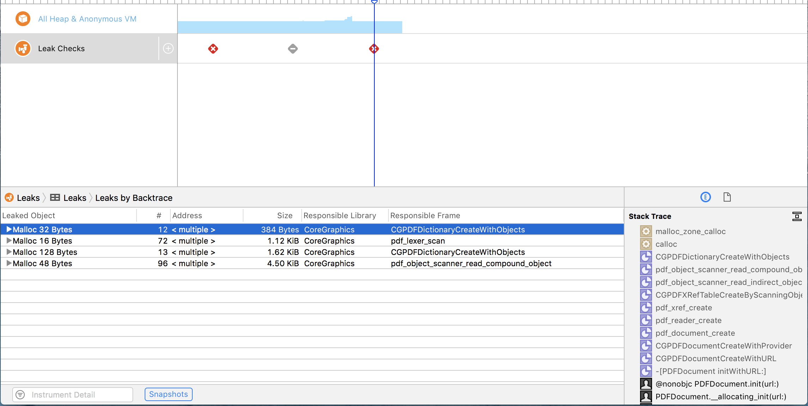

# PDF Document Bug

Initializing PDFDocument instance using **PDFDocument(url : URL)** initializer causes memory leak.

Always reproducible on macOS 10.13.6 (17G2208) , Xcode Version 9.4.1 (9F2000) . 

macOS SDK version: 10.13


```swift
if(openPanel.runModal() == NSApplication.ModalResponse.OK){
    if let pdfURL = openPanel.url {
        // memory leak happens here
        let pdf = PDFDocument(url: pdfURL)
    }
}
```



